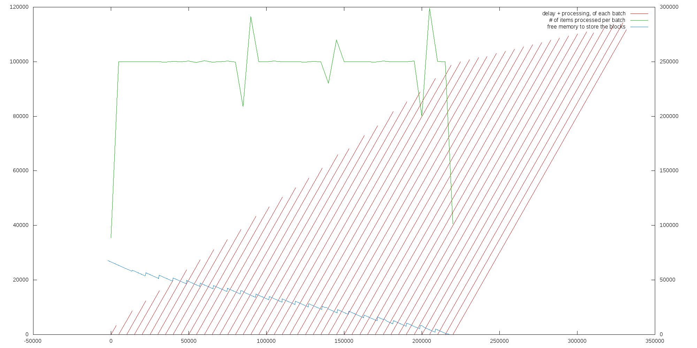
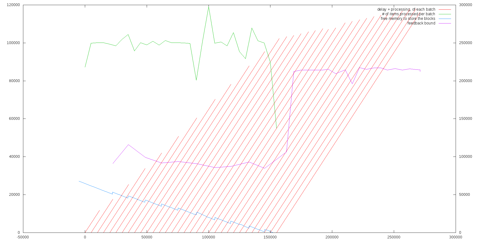
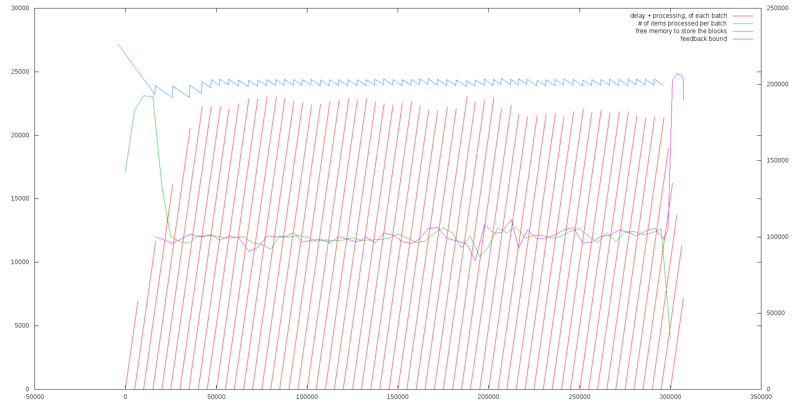
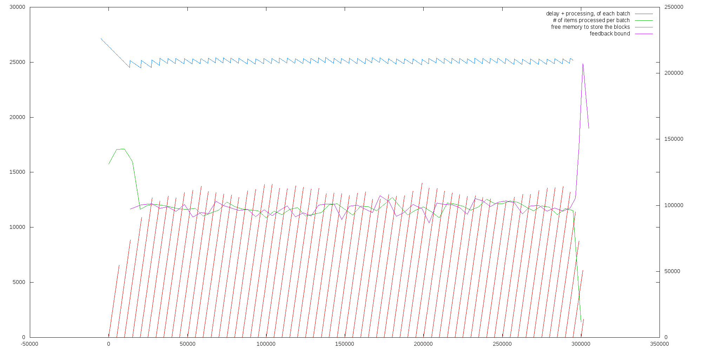

# Test runs

__For setup and all other details, look below__

## vanilla Spark 1.4.0, TCP receiver, no congestion strategy

Using [1.4.0-bin-hadoop2.4](http://www.apache.org/dyn/closer.cgi/spark/spark-1.4.0/spark-1.4.0-bin-hadoop2.4.tgz).



* the job takes longer than the batch interval to run.
  * the delay accumulate.
  * the memory usage to store the blocks to process increase.
* when the available memory to store the blocks reaches 0, blocks stop being created, the data is not processed anymore.

## streaming back pressure branch, TCP receiver, congestion strategy: ignore

Using [1.4.0-streaming-t004](https://downloads.typesafe.com/typesafe-spark/test/builds/spark-1.4.0-streaming-t004-bin-2.4.0.tgz).



* the job takes longer than the batch interval to run.
  * the delay accumulate.
  * the memory usage to store the blocks to process increase.
* the feedback loop asks for a lower amount of entries. It is ignored (as per congestion strategy).
* when the available memory to store the blocks reaches 0, blocks stop being created, the data is not processed anymore.

## streaming back pressure branch, TCP receiver, congestion strategy: drop

Using [1.4.0-streaming-t004](https://downloads.typesafe.com/typesafe-spark/test/builds/spark-1.4.0-streaming-t004-bin-2.4.0.tgz).



* the job initialy takes longer than the batch interval to run.
  * the some delay accumulate.
* the input size is limited accordingly to the feedback data.
  * no more delay accumulate.
  * the memory usage is stable.
* the test run to completion.

## streaming back pressure branch, TCP receiver, congestion strategy: sampling

Using [1.4.0-streaming-t004](https://downloads.typesafe.com/typesafe-spark/test/builds/spark-1.4.0-streaming-t004-bin-2.4.0.tgz).



* the job initialy takes longer than the batch interval to run.
  * the some delay accumulate.
* the input size is limited accordingly to the feedback data.
  * no more delay accumulate.
  * the memory usage is stable.
* the test run to completion.

## streaming back pressure branch, TCP receiver, congestion strategy: pushback

Not available for this test runs.

## streaming back pressure branch, reactive receiver

Not available for this test runs.

# Setup

The tests were executed on 3 m3.large ubuntu instances:

* 1 instance running the testbed application, providing the stream of data
* 2 instances running a 2 nodes Spark cluster:
  * node 1: Spark master + Spark slave
  * node 2: Spark streaming application + Spark slave\

## Test scenario

The test scenario is run using the [testbed application](https://github.com/skyluc/spark-streaming-testbed/tree/master/testbed).

binary: [spark-streaming-testbed-0.1.0](https://downloads.typesafe.com/typesafe-spark/test/spark-streaming-testbed/spark-streaming-testbed-0.1.0.zip)

It is a Play/Akka application which pushes a stream of numbers to clients connected to a specific port.

The test configuration is the following:

```
sequence = [
  { type = noop
    duration = 2
  }
  { type = fixed
    value = 6
    rate = 50000
    duration = 300
  }
]
```

The test scenario is a series of number `6`, sent at the rate of 50k per seconds.

## Test streaming application


The test streaming application does a resolution of the tower of Hanoi problem, for each number of the input stream. The number is used as the height of the tower.

Then does some statistics on the data from the batch: for each distinct value received:

* the number of time the value appears in the batch,
* the accumulated processing time
* the average processing time
* the standard deviation of the processing time.

source: [simple-streaming-app](https://github.com/skyluc/spark-streaming-testbed/tree/master/simple-streaming-app)

binary: [simple-streaming-app_2.10-0.1.6.jar](https://downloads.typesafe.com/typesafe-spark/test/simple-streaming-app/simple-streaming-app_2.10-0.1.6.jar)

### streaming application execution

The application is 

```
bin/spark-submit --class com.typesafe.spark.SimpleStreamingApp --master spark://ip-10-181-16-212:7077 <location/simple-streaming-app_2.10-0.1.6.jar> <testbed_ec2_internal_name> 2222 <congestion_strategy>
```

## Additional logs

Spark master, slaves and driver are running with the following additional configuration in `conf/log4j.properties`:

```
[...]
log4j.appender.console.target=System.out
[...]
log4j.appender.console.layout.ConversionPattern=%d{yyyy-MM-dd HH:mm:ss,SSSZ} %p %c{1}: %m%n
[...]

# Change this to set Spark log level
log4j.logger.org.apache.spark=WARN

log4j.logger.org.apache.spark.storage.BlockManagerInfo=INFO

log4j.logger.org.apache.spark.streaming.receiver.ReceiverSupervisorImpl=DEBUG

```

# Log processing

The log used are:

* the output from the spark-submit command, called `run.log` below.
* the standard out of the executor running the streaming receiver. See below for an example of its location, in the creation of `feedback.log`.

```bash
# extract the intresting lines
grep $'\t7\t' run.log > execution.log
# find the earliest timestamp
BASE_TIME=$(head -1 execution.log | awk '{print $2}')
# shift the time, and keep only the interesting columns
awk -v baseTime=${BASE_TIME} -F '\t' '{print $1-baseTime"\t"$2-baseTime"\t"$1-$2"\t"$4;}' execution.log > execution-processed.log
```

```bash
# extract the intresting lines
grep 'Added input' run.log > memory.log
# shift the time and normalize the memory numbers (to KB).
awk -v baseTime=${BASE_TIME} -F '[\)\, -]' '{ if ($18 == "MB") { a = $17 * 1024} else {a = $17}; if ($22 == "MB") { b = $21 * 1024 } else { b = $21 }; print $11-baseTime"\t"a"\t"b;}' memory.log > memory-processed.log
```

```bash
grep 'Received update' SPARK_HOME/work/app-xxxxxxxxxxxx-000x/x/stdout > feedback.log
awk -v baseTime=${BASE_TIME} '{ cmd = "date --date=\""$1" "$2"\" +%s%3N"; cmd | getline a ; print a - baseTime,$10 - baseTime,$12 }' feedback.log > feedback-processed.log
```

## Plots

gnuplot script:

```
set y2range [0:]
set y2tics
set yrange [0:]
set boxwidth 1500 absolute
set style arrow 1 nohead ls 1

set terminal png size 2000,1000
set output "graph.png"

plot "execution-processed.log" using 2:(0):($1-$2):3 with vector title "delay + processing, of each batch" arrowstyle 1, "" using 2:4 axes x1y2 with line title "# of items processed per batch", "memory-processed.log" using 1:($3/10) with lines title "free memory to store the blocks", "feedback-processed.log" using 1:($3 * 25) axes x1y2 with lines title "feedback bound"
```

